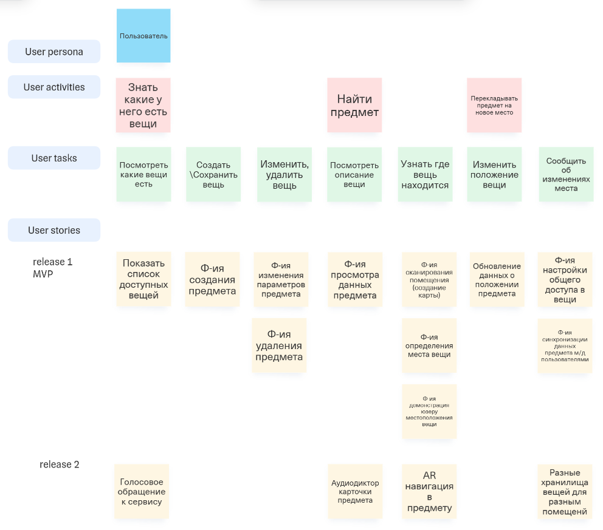
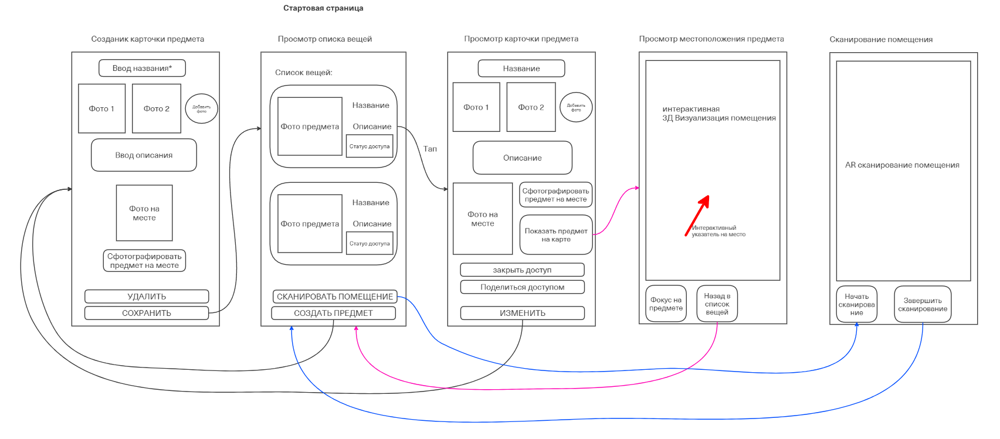

# Основные функции продукта

---

**Основные функции продукта:**

- Перечислите функции, которые будут реализованы в текущей версии продукта.

  - 3д сканирование помещений через смартфон

  - Добавление предметов в систему по фотографии

  - Каталог сохранённых предметов

  - Идентификация местоположения предмета по его фотографии

  - Указание на карте положение предмета

---

- Укажите функции, которые не будут реализованы в рамках текущей версии продукта.

  - Распознавание людей

  - Аудио сопровождение

  - Интеграция с IoT датчиками и умным домом

  - Офлайн режим

  - Поддержка других языков (кроме русского и английского)

---

## Визуализация

---

:::note
Изображения должны находиться в папке `img` относительно корня документации.
:::